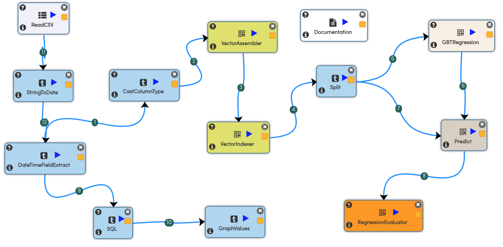

# Bike Sharing Analyis

## Dataset

The dataset contains bike rental info from 2011 and 2012 in the Capital bikeshare system, plus additional relevant information. This dataset is from Fanaee-T and Gama (2013) and is hosted by the UCI Machine Learning Repository

The sample being used boils down to:

- Structured data set in the form of a comma-separated CSV and
- Consists of 10877 rows ( can be found in /data directory of the Sparkflows installation).
- Each record is count of rentals grouped by a given hour in the past and environmental factors at that time (season, holiday, temperature, wind-speed etc.)

## Workflow

**The workflow consists of the following steps:**

- Reads in the dataset from a tab separated file:
- Applies some basic pre-processing of the input data. This takes the form of:
  - DataTimeFieldExtract on the “datedate” column. This basically parses out the datetimestamp as year, month, dayofmonth, hour.
  - CastColumnType on the “count” column. This basically converts the integer to a double.  This step is needed, since Spark-GBTRegression (an upcoming step) requires it.
  - Applies VectorAssembler to concatenate columns into a feature vector and VectorIndexer:

VectorAssembler is a Spark MLLib provided algorithm that Sparkflows exposes to you as a plug-and-play “node”. VectorAssembler is a transformer that combines a given list of columns into a single vector column. It is useful for combining raw features and features generated by different feature transformers into a single feature vector, in order to train ML models like logistic regression and decision trees.

VectorIndexer  is a  Spark MLLib provided algorithm that Sparkflows exposes to you as a plug-and-play “node”. It helps index categorical features in datasets of Vectors. It can both automatically decide which features are categorical and convert original values to category indices.

- Splits the dataset into (.8, .2)
  - 80% (~8700 rows) is used for training and 
  - The model is evaluated based on how it predicts on the remaining 20% (~ 2900 rows).

- Performs GBT (Gradient Boosted Tree) Regression:
  - This is a Spark MLLib provided algorithm that Sparkflows exposes to you as a plug-and-play “node”. Gradient-boosted trees (GBTs) are a popular regression method using ensembles of decision trees.

- Performs prediction using the model generated on the remaining 20% dataset

- Finally evaluates the result.

## Output

Below is the output of executing the workflow:

