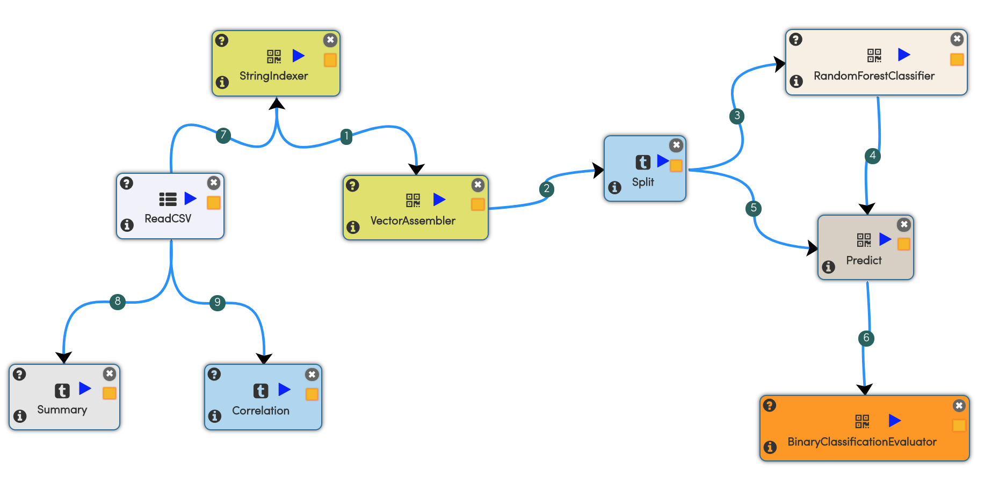

# Telco Churn Prediction

This workflow creates a Random Forest Classification Model for predicting Telco Churn.

## Dataset

The dataset is available from sgi.com

- https://www.sgi.com/tech/mlc/db/
- https://www.sgi.com/tech/mlc/db/churn.all
- https://www.sgi.com/tech/mlc/db/churn.names

### Dataset Description

Churn data (artificial based on claims similar to real world)

- state: discrete.
- account length: continuous.
- area code: continuous.
- phone number: discrete.
- international plan: discrete.
- voice mail plan: discrete.
- number vmail messages: continuous.
- total day minutes: continuous.
- total day calls: continuous.
- total day charge: continuous.
- total eve minutes: continuous.
- total eve calls: continuous.
- total eve charge: continuous.
- total night minutes: continuous.
- total night calls: continuous.
- total night charge: continuous.
- total intl minutes: continuous.
- total intl calls: continuous.
- total intl charge: continuous.
- number customer service calls: continuous.

## Workflow

**The workflow consists of the following steps:**

- Reads in the CSV file
- Uses StringIndexer to convert some features to numeric values
- Splits the data for training and testing
- Applies Random Forest Classification on the training data
- Makes predictions on the test data
- Finally evaluates the test results

**The workflow does 2 more things:**

- Finds the summary statistics of the various columns
- Finds the correlations matrix between the various columns

## Output

Below is the output of executing the workflow:

